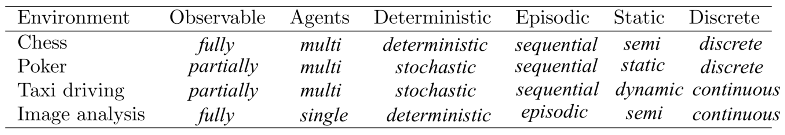
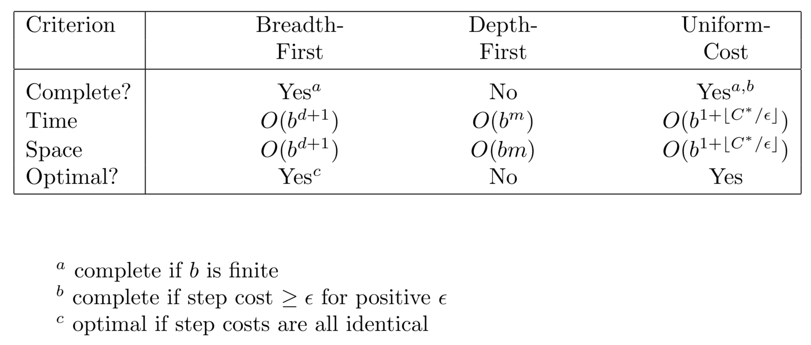
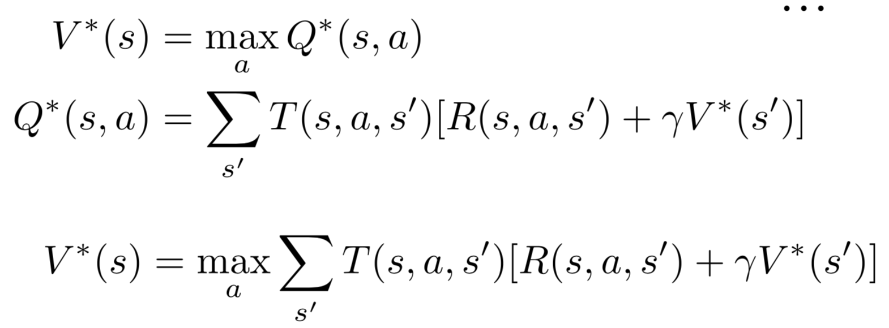
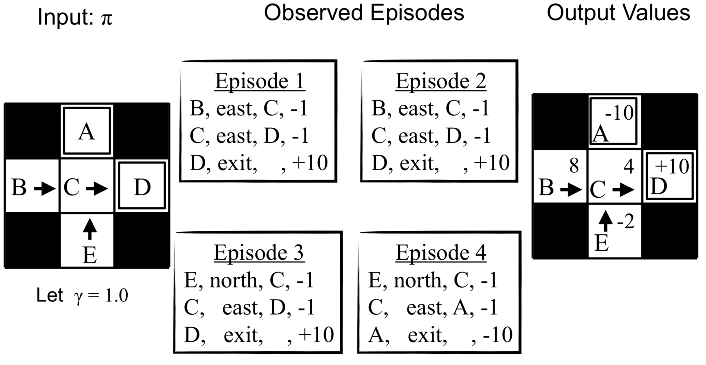
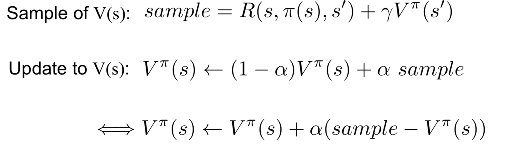
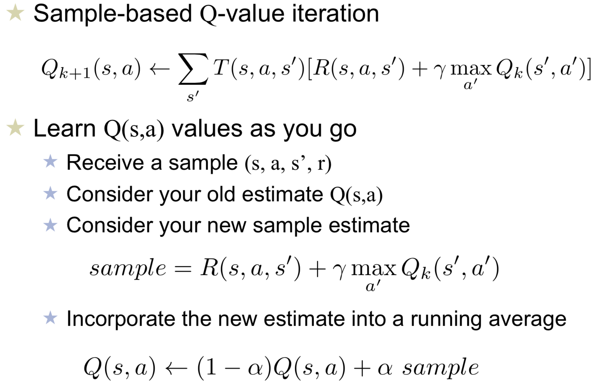
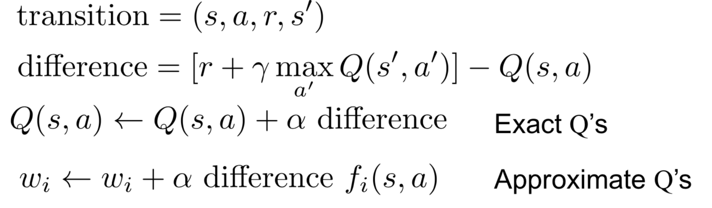

# Introduction
- Environment Types:  Fully observable --access to the complete state of the
environment at each point(vs. partially observable); Deterministic --next state of the environment is completely determined
by the current state and the action(vs. stochastic); Episodic --The choice of action in each episode depends only on the episode itself(vs. sequential)

- 
# Search
- BFS vs DFS queue vs stack: stack may be more convenient to implement by recrusion but can overload; target is shallow - BFS otherwise - DFS;

- 
- A* tree search is optimal if it uses an admissible heuristic;
# CSP
- AC3: head <- tail, only update tail;
- Minimum remaining values (MRV)->Degree Heuristic (Deg:Choose the variable with the most constraints on remaining variables)->LCV(Choose the value that rules out the fewest values in the remaining variables)
- If a CSP has a solution, min-conflicts is not guaranteed to find it
# Adversarial Search
- Note that a utility functions is not unique: $U'(S)=aU(S)+b,a>0$
# Markov Decision Processes
- A sequential decision problem for a fully observable, stochastic environment with a Markovian transition model and additive rewards is called a Markov decision process (MDP)
- 
# Reinforcement learning
- Model-Based Learning: count R and T;
- Direct Evaluation
- 
- Temporal Difference (TD) Learning
- 
- Q-learning
- 
- Linear Value Functions
- 
