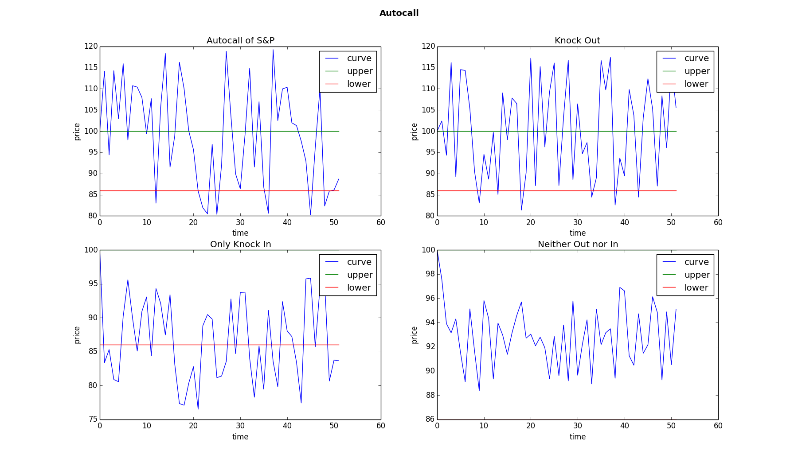
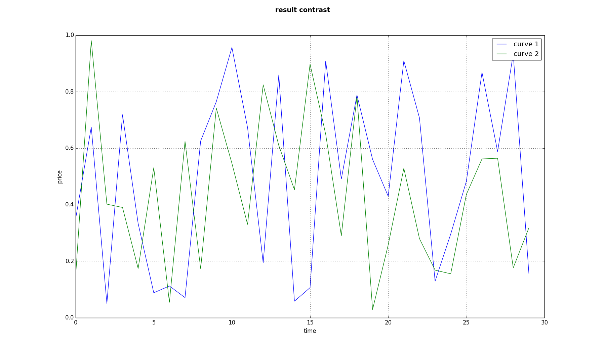
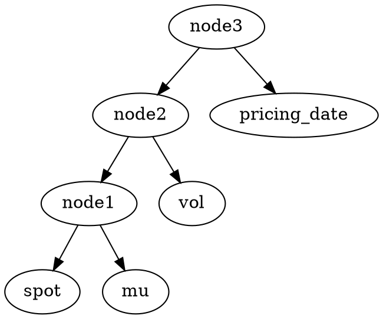

# Interim report of Wang Peng – Application of Deep Learning in pricing Structured Products
> Editor: Wang Peng
> UID: 3035420027

When conducting **Deep Learning**, we all need **train set and test set**. This time I use the traditional method **Monte Carlo simulation** to produce many real products and feed the data to neural networks. That is why we fisrt implement the part of Monte Carlo simulation.

***   

[TOC]

## 1. Structured Products ——Autocall
> Structured Products are big set of financial products and some of them are kind of financial derivatives like **Autocall whose price rely on the change of underlying price**. Here I just use a real contract of autocall whose **underlying is S&P index** as example to demonstate how the autocall works:

|item|info|
|-|-|
|start|’2017/11/9’|
|end|‘2018/11/15’|
|pricing_date|’2017/11/9‘|
|spot (underlying price on pricing date)|100.|
|knock out date|['2017/12/14'],['2018/1/11'],['2018/2/8'],['2018/3/8'],['2018/4/12'],['2018/5/10'],['2018/6/14'],['2018/7/12'],['2018/8/9'],['2018/9/13'],['2018/10/11']|
|knock in date|‘all’|                             
|knock out barriers|1.|
|knock in barriers|0.86|
|knock out rate|0.24|
|bonus (knock in rate)|0.14|
|mu|-0.12|
|vol|0.15|
|risk free rate|0.|



Supppse you buy 1 million such kind of autocall. Then there are 3 scenarios when calculating **payoff**:
- scenario 1 —— knock out:
  $payoff := 1\ million \times (1 + knock\ out\ rate \times acutal\ duration ) \times \exp^{-(risk\ free\ rate - mu)\times auctal\ duration} $
- scenario 2 —— only knock in:
  $payoff := 1\ million \times (1 + bonus\times duration)\times \exp^{-(risk\ free\ rate - mu)\times duration} $
- scenario 3 —— neither out nor in:
  $payoff := some\ fixed\ amount\ of\ money\ (usually\ less\ than\ principle)$

Apparently the concept of **payoff** is very important as it is the **internal price** of autocall. If the sell side (usually investment banks) can predict the underlying price in the future, they can calculate the payoff with the **price curve** and then obtain the **internal price** as their trade standard. So it is really necessary to find a effective way of pricing.

## 2. Monte Carlo simulation
During the past few years, people use a method called **Monte Carlo simulation** to predict the price of underlying and then get the internal price of Structured Products. Usually, this method has two basic hypotheses:
> the return rate of underlying price is Log-normal distribution
> the interest rate and volability are fixed during the duration of product

So, if the price of index S&P on start date is $S_0$ and $\Delta t$ is one trade day with interest rate as $mu$, the price of it in the following year can be like this:

$$\begin{cases}
S_1 = S_0\times e^{vol\times W_t + (mu - \frac{vol^2}{2})\times \Delta t}\\
S_2 = S_1\times e^{vol\times W_t + (mu - \frac{vol^2}{2})\times \Delta t}\\
......\\
......\\
S_n = S_{n - 1}\times e^{vol\times W_t + (mu - \frac{vol^2}{2})\times \Delta t}\\
\end{cases}
$$

Note that $W_t$ is a random variable. Usually, people will do such kind of simulation hundreds of thousand times and the random variable is different each time in each trade day. So we can get hundreds of thousand **different underlying price curves**. With each curve, we can get one different internal price of autocall. Then we can just use the average number of them as the real internal price.



According to our analysis, the work flow of conducting **Monte Carlo simulation** can be like this:
> Data Preprocessing $\Rightarrow$ Simlation of many underlying curves $\Rightarrow$ Judgment of knock out and knock in $\Rightarrow$ calculating payoff
### Part 1: Data Preprocessing
Use **dictionary format** to represent the raw data of autocall contract:
```
{
    'start': '2017/11/9',
    'end': '2018/11/15',
    'pricing_date': '2017/11/9',
    'spot': 100.,
    'knockoutdays': [['2017/12/14'],['2018/1/11'],['2018/2/8'],['2018/3/8'],['2018/4/12'],['2018/5/10'],['2018/6/14'],
                     ['2018/7/12'],['2018/8/9'],['2018/9/13'],['2018/10/11']],
    'knockindays': 'all',
    'upper_barrier': 1.,
    'lower_barrier': 0.86,
    'interest_rate': 0.14,
    'knockoutrate': 0.14,
    'mu': 0.1,
    'vol': 0.2,
    'r': 0.1
}
```
As you can see, some necessary data we need when pricing is in **char** format. What is more, our Auto_Call contract is based on **real calender**, whose data format is **'yyyy/mm/dd'**. That means we need a specific module **called Bussiness calender**, which can:
- change **char format** into **datetime format**
- cut time sequence
- read in holiday file
- give next bussiness_day and judge whether one day is bussiness_day or not
- produce one time sequence with specific start and end date

Here is my test case of **Bussiness Calender** module:
```
from Bussiness_Calender import Bcalender
import numpy as np
test = Bcalender.BussinessCalender()
rec = test.loadfile()
print np.array(test.timeseries(rec[0],rec[1])).reshape(6,4)
```
With function **loadfile**, we get 2 date '2018/1/1' and '2018/2/1'. After seting them as start and end, we can have a time sequence with only bussiness_day between them in **datetime format**:

```
[[datetime.date(2018, 1, 1) datetime.date(2018, 1, 2)
  datetime.date(2018, 1, 3) datetime.date(2018, 1, 4)]
 [datetime.date(2018, 1, 5) datetime.date(2018, 1, 8)
  datetime.date(2018, 1, 9) datetime.date(2018, 1, 10)]
 [datetime.date(2018, 1, 11) datetime.date(2018, 1, 12)
  datetime.date(2018, 1, 15) datetime.date(2018, 1, 16)]
 [datetime.date(2018, 1, 17) datetime.date(2018, 1, 18)
  datetime.date(2018, 1, 19) datetime.date(2018, 1, 22)]
 [datetime.date(2018, 1, 23) datetime.date(2018, 1, 24)
  datetime.date(2018, 1, 25) datetime.date(2018, 1, 26)]
 [datetime.date(2018, 1, 29) datetime.date(2018, 1, 30)
  datetime.date(2018, 1, 31) datetime.date(2018, 2, 1)]]
```  


### Part 2: Simlation of many underlying curves
The function is called **underlying_curve** in class **autocall**:
```
def underlying_curve(self, s0, start, end, curve_num, mu, vol):
    dateseries = self.calender.timeseries(start, end)
    t = len(dateseries)
    first = np.ones(curve_num)*s0
    np.random.seed(0)
    Wt = np.random.normal(self.aver, self.stdi, [curve_num, t-1])
    curve = s0*np.exp(vol*Wt + (mu - vol**2/2)*self.delta_t).cumprod(1)
    curve = np.c_[first, curve]
    curve = pd.DataFrame(curve, columns=dateseries)
    return curve
```
You can find that we use the function in **module calender** and all the random curves are stored in format of **DataFrame**

### Part 3: Judgment of knock out and knock in
The code is shown below:

```
def knock_out(self, outdate, upper_barriers, std_price, underlying_curve):
    if outdate == []:
        return False
    else:
        if type(upper_barriers) is list:
            lg = len(outdate)
            for i in range(lg):
                index = outdate[i]
                if underlying_curve[index] > std_price*upper_barriers[i]:
                    return index
            return False
        else:
            for i in outdate:
                if underlying_curve[i] > std_price*upper_barriers:
                    return i
            return False

def knock_in(self, indate, lower_barriers, std_price, underlying_curve):
    if indate == []:
        return False
    else:
        if indate is 'all':
            for i in underlying_curve.index:
                if underlying_curve[i] < std_price*lower_barriers:
                    return True
            return False
        else:
            if type(lower_barriers) is list:
                lg = len(indate)
                for i in range(lg):
                    index = indate[i]
                    if underlying_curve[index] < std_price*lower_barriers[i]:
                        return True
                return False
            else:
                for i in indate:
                    if underlying_curve[i] < std_price*lower_barriers:
                        return True
                return False
```
### Part 4: Calculating payoff
With all the random curves and judgment above, we can calculate many different payoffs and then average them to obtain the **internal price**. Note that this part really consumes most time of all the simulation process. According to my test, if we set **principle 100 USD, 365 per year, 252 bussiness days per year and curve number is 50000**, pricing one autocall contract may need around **10s** with my program.

### Part 5: Drawbacks
This original method do make sense and help us a lot in a really long period. However, it also has some drawbacks:
> **Speed**. According to the process of this method we mentioned above, we have to do hundreds of thousand times simulation (usually 100000) and the time consuming is really huge which cannot meet the demand of fast trade
> **Fluctuation**. As we use random number in each simulation, we will always get different internal price each time even though the difference is really tiny. But we want fixed price of autocall because any slight fluctuation can casue a lot of problem for traders when hedging

Under this background, I decide to adopt the method of Deep Learning to try to solve these problems.
## 3. Building MongoDB to Store Data
As I said above, the Monte Carlo simulation need a lot of time when pricing one contract. We have to wait for **more than 20min for just 100 pieces of different contracts** So it is necessary to build a DataBase to store some amount of contracts for using when training our network. Mongo DB is absolutly a good choice:
```
myclient = pymongo.MongoClient('mongodb://localhost:27017/')
mydb = myclient['pricing']
mycol = mydb['new_record']
```
**Here I store almost 2000 pieces of contracts with internal price when 4 factors -- spot, pricing_date, mu and vol vary in some scale:**
>- spot：100 ± 5, interval between 2 consistent point is 0.1, totally 100 points, base number is 100
>- pricing_date：4 days ['2017/11/9', '2018/2/19', '2018/5/21', '2018/8/20'], base number is '2017/11/9'
>- mu：2 points，-0.12，-0.4，base number is -0.12
>- vol：2 points，0.15，0.25，base number is 0.15
One single contract in the DB looks like this:

So the **size of product space is $101\times 4\times 2\times 2= 1616$**

After invoking the method of **Monte Carlo simulation**, we can get 1616 pieces of products with their own internal price and one of them in DataBase can be like this:
```
{
	"_id" : 1,
	"end" : "2018/11/15",
	"knockoutdays" : [
		[
			"2017/12/14"
		],
		[
			"2018/1/11"
		],
		[
			"2018/2/8"
		],
		[
			"2018/3/8"
		],
		[
			"2018/4/12"
		],
		[
			"2018/5/10"
		],
		[
			"2018/6/14"
		],
		[
			"2018/7/12"
		],
		[
			"2018/8/9"
		],
		[
			"2018/9/13"
		],
		[
			"2018/10/11"
		]
	],
	"upper_barrier" : 1,
	"vol" : 0.15,
	"pricing_date" : "2018/2/19",
	"lower_barrier" : 0.86,
	"spot" : 95.6,
	"mu" : -0.04,
	"start" : "2017/11/9",
	"r" : 0,
	"knockindays" : "all",
	"knockoutrate" : 0.14,
	"price" : 0.8680125359665264,
	"interest_rate" : 0.14
}
```

## 4. Recursive neural network
### Part 1: Normal Usecase of Recursive neural network
A sentence consists of some words and all the words can be represented as vector:


Besides sequence, there are more complicated structures like trees and graphs:


This long sentence is shown in tree format and each word in it can be a vector. Every word interact with each other from the bottom to the top. At the end, we can get **one vector at the root node which represent the whole sentence**.

For example, suppose vector A[1,7] represent sentence 'my birthday is in 1991' and vector B[0.9, 6.8] represent sentence 'I am 26 now'. It is quiet reasonable that vector A and B are very close in such **language space** as the 2 sentences are saying almost the same thing.

**Working as encoder, the Recursive neural network can cast some thing into a vector space and use a vector to represent the information we need**. That inspires me a lot.

### Part 2: Use Recursive neural network for pricing
Suppose we have one **Standard Contract** with **spot** 100, **pricing data** '2017/11/9', **mu** -0.12, **vol** 0.15:

```
{
	"_id" : 1,
	"end" : "2018/11/15",
	"knockoutdays" : [
		[
			"2017/12/14"
		],
		[
			"2018/1/11"
		],
		[
			"2018/2/8"
		],
		[
			"2018/3/8"
		],
		[
			"2018/4/12"
		],
		[
			"2018/5/10"
		],
		[
			"2018/6/14"
		],
		[
			"2018/7/12"
		],
		[
			"2018/8/9"
		],
		[
			"2018/9/13"
		],
		[
			"2018/10/11"
		]
	],
	"upper_barrier" : 1,
	"vol" : 0.15,
	"pricing_date" : "2017/11/9",
	"lower_barrier" : 0.86,
	"spot" : 100.,
	"mu" : -0.12,
	"start" : "2017/11/9",
	"r" : 0,
	"knockindays" : "all",
	"knockoutrate" : 0.14,
	"price" : 0.8680125359665264,
	"interest_rate" : 0.14
}
```
Then we use **vector P** to represent the **standard contract** in the vector space of autocall products and use the **norm of vector P as the price of this contract**.

If there is another contract which has same factors as **standard contract except that the spot increase by 0.1 to 100.1**. It simply make sense that **the vector of this new contract definitly has strong correlation with vector P because this new contract does not change a lot from standard contract**.

With all these guess, we can use Recursive neural network with tree structure to build a **vector encoder**:

and main idea can be the following steps:
- **Vectorlization**: To use the RNN model, all the input must be vectors. So I set a vector space **$v-t-r$** for all the input and decide them into 3 classes:
  - value: spot，upper barrier， lower barrier
  - time: start date，end date，pricing date，knockout days，knockin days
  - rate: interest rate，knockout rate，mu，vol，r

  Then cast all the factors into the 3 dimension space: $v-t-r$


  Before vectorization:
  ```
  {
              'start': '2017/11/9',
              'end': '2018/11/15',
              'pricing_date': '2017/11/9',#
              'spot': 100.,  #
              'knockoutdays': [['2017/12/14'],['2018/1/11']],
              'knockindays': [['2018/9/13'],['2018/10/11']],
              'upper_barrier': 1.,
              'lower_barrier': 0.86,
              'interest_rate': 0.14,
              'knockoutrate': 0.14,
              'mu': -0.12, #
              'vol': 0.15, #
              'r': 0.
      }
  ```
  After vectorization:

  ```
  {
              'end': array([[0., 1., 0.]]),
              'knockoutdays': array([[[0.        , 0.09677419, 0.        ],[0.        , 0.17204301, 0.        ]]]),
              'upper_barrier': array([[[1., 0., 0.],[1., 0., 0.]]]),
              'vol': array([[0., 0., 0.15]]),
              'pricing_date': array([[0., 0., 0.]]), 'lower_barrier': array([[[0.86, 0.  , 0.  ],[0.86, 0.  , 0.  ]]]),
              'spot': array([[100., 0., 0.]]),
              'mu': array([[0., 0., -0.12]]),
              'start': array([[0., 0., 0.]]),
              'r': array([[0., 0., 0.]]),
              'knockindays': array([[[0.        , 0.83064516, 0.        ],[0.        , 0.90591398, 0.        ]]]),
              'knockoutrate': array([[[0.  , 0.  , 0.14],[0.  , 0.  , 0.14]]]),
              'interest_rate': array([[0.  , 0.  , 0.14]])
      }
  ```
- **Pricing**: feed $\Delta_{pricing\ date}, \Delta_{spot}, \Delta_{mu}, \Delta_{vol}$ into the neural network and get the $\delta_{price}$ at the root node3. That means the price of one specific contract:
  $Price\ of specific\ contract := f(\Delta_{pricing\ date}, \Delta_{spot}, \Delta_{mu}, \Delta_{vol}) + Price\ of\ Standard\ Contract$
### Part 3: Implementation with TensorFlow
Recall that we already store 1616 pieces of contracts in our DataBase. This time we use **1423 of them as train set and the others as test set**.
Note that each contract has its **"true price" from Monte Carlo simulation**. Besides, with our RNN model, we can also get another **predict price**:

$Predict\ Price := f(\Delta_{pricing\ date}, \Delta_{spot}, \Delta_{mu}, \Delta_{vol}) + Price\ of\ Standard\ Contract$

So the **cost function** can be:

$cost := minimize(True\ Price - Predict\ Price)$

#### Step 1: For train set
This part works for fetching train set from DataBase and the number of contract is 1423.
```
db = vector(collection_name='new_record', amount= 1423)
    def fetch_train_set(self):
        start = ti.time()
        train_set = [self.db.vectorization(item) for item in self.db.fetch_data()]
        end = ti.time()
        consume = str(end - start) + 's'
        print 'preprocessing is over, using'+consume
        return train_set
```

#### Step 2: About learning rate
The set of learning_rate is like this:
```
global_step = tf.Variable(0, trainable=False)
    init_learning_rate = 0.01
    learning_rate = tf.train.exponential_decay(init_learning_rate,
                                               global_step=global_step,
                                               decay_steps=100,
                                               decay_rate=0.95)
    add_global = global_step.assign_add(1)
```


#### Step 3: Initialization
Here we initialize our neural network according to the structure we plot above and all the network factors.
```

    with tf.name_scope('para_hiden_layer'):
        weight = tf.Variable(tf.random_uniform([3,3], -1., 1.), name='weight')
        bias = tf.Variable(tf.zeros([]), name='bias')
    with tf.name_scope('rnn'):
        u1 = tf.Variable(tf.random_uniform([6,3], -1., 1.), name='u1')
        b1 = tf.Variable(tf.zeros([]), name='b1')


    with tf.name_scope('Price'):
        price = tf.placeholder(tf.float32, name='price')
    with tf.name_scope('Spot'):
        spot = tf.placeholder(tf.float32, [1, 3], name='spot')
    with tf.name_scope('Pricing_date'):
        pricing_date = tf.placeholder(tf.float32, [1, 3], name='pricing_date' )
    with tf.name_scope('Mu'):
        mu = tf.placeholder(tf.float32, [1, 3], name='mu')
    with tf.name_scope('Vol'):
        vol = tf.placeholder(tf.float32, [1, 3], name='vol')

    def forward(self, input, weight, bias):
        out = tf.nn.tanh(tf.matmul(input, weight) + bias)
        return out
```

#### Step 4: Forward propagation
Connect all the tensor into flow and get the optimizer:
```
def flow(self):
    with tf.name_scope('spot_out'):
        spot_out = self.forward(self.spot, self.weight, self.bias)
    with tf.name_scope('pricing_date_out'):
        pricing_date_out = self.forward(self.pricing_date, self.weight, self.bias)
    with tf.name_scope('mu_out'):
        mu_out = self.forward(self.mu, self.weight, self.bias)
    with tf.name_scope('vol_out'):
        vol_out = self.forward(self.vol, self.weight, self.bias)
    with tf.name_scope('node1_input'):
        node1_input = tf.concat([spot_out, mu_out], 1)
    with tf.name_scope('Node1'):
        node1 = self.forward(node1_input, self.u1, self.b1)
    with tf.name_scope('node2_input'):
        node2_input = tf.concat([vol_out, node1], 1)
    with tf.name_scope('Node2'):
        node2 = self.forward(node2_input, self.u1, self.b1)
    with tf.name_scope('node3_input'):
        node3_input = tf.concat([node2, pricing_date_out], 1)
    with tf.name_scope('Node3'):
        node3 = self.forward(node3_input, self.u1, self.b1)

    return node3

def unti(self):
    node = self.flow()
    with tf.name_scope('price_'):
        price_ = tf.sqrt(tf.reduce_sum(tf.square(node)), name='prediction')
    with tf.name_scope('loss'):
        loss = tf.reduce_sum(tf.square(price_ - self.price + self.std_price))
    with tf.name_scope('optimizer'):
        optimizer = tf.train.GradientDescentOptimizer(self.learning_rate).minimize(loss)
```

#### Step 5: Train
Start tf.session and train the model for **100 times**. At last, **save the network model in the last 2 iteration with Saver.**
```
def train(self):
    train_set = self.fetch_train_set()
    with tf.Session() as sess:
        sess.run(tf.global_variables_initializer())
        saver = tf.train.Saver(max_to_keep=2)
        price_, loss, optimizer = self.unti()
        for i in range(self.iteration):
            loss_holder = 0.
            train = np.copy(train_set)
            print '-'*77
            for j in train:
                _, lo, pri, add, rate = sess.run([optimizer, loss, price_, self.add_global, self.learning_rate],
                                                feed_dict={self.price: j['price'],
                                                           self.spot: j['spot'],
                                                           self.pricing_date: j['pricing_date'],
                                                           self.mu: j['mu'],
                                                           self.vol: j['vol'],
                                                           })
                loss_holder += lo
            if (i + 1) % 1 == 0:
                print '\n'
                saver.save(sess, './model_try/my-model', global_step=i + 1)
                print 'No.' + str(i + 1) + 'stored'
            aver_loss = loss_holder/1423.
            print 'After No.' + str(i + 1) + 'iteration，aveage loss：'
            print aver_loss
```

#### Step 6: test
Finally, restore our network model and test it with the remaining 100+ pieces of contracts. As time is limit, I just put the test result here:
```
def fetch_test_set(self, start_id, end_id):
    temp = [self.db.fetch_one(index)[0] for index in np.arange(start_id, end_id + 1, 1)]
    return [self.db.vectorization(item) for item in temp]

def restore_test(self):
    # fetching test set
    start = ti.time()
    test = self.fetch_test_set(1425, 1616)
    test_set = np.copy(test)
    end = ti.time()
    print 'consumption:'+ str(end-start) + 's'+'\n' + 'start test'

    error_holder = []
    with tf.Session() as sess:
        # restore
        saver = tf.train.import_meta_graph('./model_recursive/my-model-300.meta')
        saver.restore(sess, tf.train.latest_checkpoint('./model_recursive/'))

        graph = tf.get_default_graph()

        price = graph.get_tensor_by_name('Price/price:0')
        spot = graph.get_tensor_by_name('Spot/spot:0')
        pricing_date = graph.get_tensor_by_name('Pricing_date/pricing_date:0')
        mu = graph.get_tensor_by_name('Mu/mu:0')
        vol = graph.get_tensor_by_name('Vol/vol:0')

        #
        loss = graph.get_tensor_by_name('loss/Sum:0')
        feed_list = [
            {
                price: one['price'],
                spot: one['spot'],
                pricing_date: one['pricing_date'],
                mu: one['mu'],
                vol: one['vol']
            } for one in test_set]
        for piece in feed_list:
            pri, lo = sess.run([price, loss], piece)
            error_holder.append(lo/pri)
        return np.array(error_holder)
```
```
time for fetching data：86.3984370232s
start test
rate when difference is lower than 2% among all 192 pieces of contracts：
0.848958333333

time for fetching data：84.3958990574s
start test
rate when difference is lower than 5% among all 192 pieces of contracts：
0.9375
```
#### Step 7: Pricing with neural network
Here with the restored model, user can change these 4 input and get the price. Note that the principle is 1 doller.
Besides, the well trained model is stored in **.meta format**, which can be invoked and revised easily with TensorFlow methods. That is why we use tensorflow.

```
# input area
input= {
        'start': '2017/11/9',
        'end': '2018/11/15',
        'pricing_date': '2017/11/9', #
        'spot': 100.,  #
        'knockoutdays': [['2017/12/14'],['2018/1/11'],['2018/2/8'],['2018/3/8'],['2018/4/12'],['2018/5/10'],['2018/6/14'],
                         ['2018/7/12'],['2018/8/9'],['2018/9/13'],['2018/10/11']],
        'knockindays': 'all',
        'upper_barrier': 1.,
        'lower_barrier': 0.86,
        'interest_rate': 0.14,
        'knockoutrate': 0.14,
        'mu': -0.12, #
        'vol': 0.15, #
        'r': 0.
}
std_price = 0.952298142703
db = vector()
product = db.vectorization(input)

with tf.Session() as sess:
    # restore
    saver = tf.train.import_meta_graph('./model_recursive/my-model-300.meta')
    saver.restore(sess, tf.train.latest_checkpoint('./model_recursive/'))

    graph = tf.get_default_graph()
    #
    spot = graph.get_tensor_by_name('Spot/spot:0')
    pricing_date = graph.get_tensor_by_name('Pricing_date/pricing_date:0')
    mu = graph.get_tensor_by_name('Mu/mu:0')
    vol = graph.get_tensor_by_name('Vol/vol:0')

    #
    price_ = graph.get_tensor_by_name('price_/prediction:0')
    feed_list = {
            spot: product['spot'],
            pricing_date: product['pricing_date'],
            mu: product['mu'],
            vol: product['vol']
        }
    print sess.run(price_, feed_list) + std_price

```
## 5. Outline and Progress of this project
My project can be divided into almost 7 stages:
### Stage 1: Implementation of Monte Carlo simulation
In this part, traditional method of pricing is conducted and finishd for preparing the train and test set of Deep Learning. Among the normal data preprocessing, the module **Bussiness Calender** is also finishd.
### Stage 2: Building the DataBase
Invoke the method of Monte Carlo simulation and store enough contracts into MongoDBn for fast fetching.
### Stage 3: Recursive neural network
This is the key part of project. To fulfill the **RNN pricer** , a lot of preparation should be done including **Vectorlization**. The **store and restore** of model are also important.

**All the work above are finishd now**

### Stage 4: GPU Accelerate
Even though the accuracy of the RNN model is somehow good, I still hold the view that it can be better because our train set is not big enough. There is no doubt that powerful GPU can help us get **more real contracts** and **accelerate the process of training and testing the neural network**.

**For this part, I may need 2 weeks time.**

### Stage 5: About Greeks
Greeks are figures based on the **price of autocall**. Actually, financial companys focus more on Greeks for hedging. If time is sufficient, I will cover this part.

**For this part, I may need 2 weeks.**

### Stage 6: Web Application
It is unfriendly for users to change the code when pricing with the model. So a webpage is necessary for them to input the variables and finish the pricing process with simply pressing a button.

**2 weeks time needed for this part**

### Stage 7: Writing documents
**1 week is enough**
### 测试
